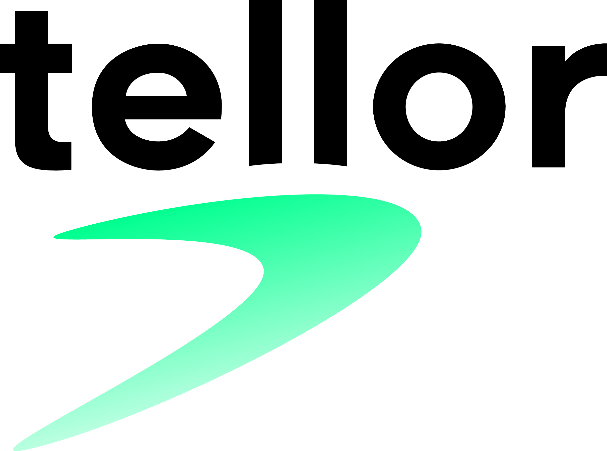
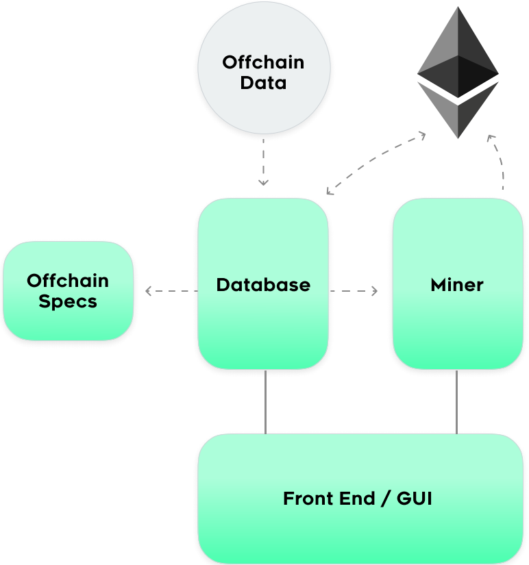

# Introduction

 

 

> ### ⚠️ Note!
>
> Telliot docs are synced from the project repository. To edit please visit:  
>  [Telliot gitbook space](https://docs.tellor.io/telliot)  
>  or  
>  [Telliot github repo](https://github.com/tellor-io/telliot/tree/master/docs)

## Telloit

This is the main cli of the project. One if its commands is to run in mining mode\(solve a POW challenge\) and submit values to the tellor oracle contract. It's built on Go and utilizes a split structure. The database piece is a LevelDB that keeps track of all variables \(challenges, difficulty, values to submit, etc.\) and the miner simply solves the PoW challenge. This enables parties to split the pieces for optimization.

The Tellor system is a way to push data on-chain. What pieces of data are pushed are specificied in the `configs/indexes.json`. Note that the data corresponds to a specific API. The tellor mining system is set up to pull api data to generate these values to submit on-chain once a correct nonce is mined. These specific apis are just suggestions. The system is not guarunteed to work for everyone. It is up to the consnesus of the Tellor token holders to determine what a correct value is. As an example, request ID 4 is BTC/USD. If the api's all go down, it is the responsibility of the miner to still submit a valid BTC/USD price. If they do not, they risk being disputed and slashed. For these reasons, please contribute openly to the official Tellor miner \(or an open source variant\), as consensus here is key. If you're miner gets a different value than the majority of the of the other miners, you risk being punished.

A list of all PSR's\(pre specified requests\) and the expected data can be found [here](https://github.com/hhio618/TellorDocs/tree/8abfd2ef082e30008d51baa2e790eb176495927c/pkg/tracker/psrs.go).

### Instructions for deployment

* [Telliot Instructions](https://github.com/hhio618/TellorDocs/tree/8abfd2ef082e30008d51baa2e790eb176495927c/telliot-documentation/docs/setup-and-usage.md)

### Contributing and building from source

Contributions are very welcome!  
 See our [04\_contributing.md](contributing.md) for more information.

### Run with Docker

Available tags: [https://hub.docker.com/u/tellor](https://hub.docker.com/u/tellor) docker run -v $\(pwd\)/.local:/configs tellor/telliot:master mine

### Maintainers

This repository is maintained by the [Tellor team](https://github.com/orgs/tellor-io/people)

#### DISCLAIMER

Mine at your own risk.

Mining requires you deposit 1000 Tellor Tributes. These are a security deposity. If you are a malicious actor \(aka submit a bad value\), the community can vote to slash your 1000 tokens.

Mining also requires submitting on-chain transactions on Ethereum. These transactions cost gas \(ETH\) and can sometimes be signifiant if the cost of gas on EThereum is high \(i.e. the network is clogged\). Please reach out to the community to find the best tips for keeping gas costs under control or at least being aware of the costs.

If you are building a competing client, please contact us. The miner specifications are off-chain and the validity of the mining process hinges on the consensus of the Tellor community to determine what proper values are. Competing clients that change different pieces run the risk of being disputed by the commmunity.

There is no guaruntee of profit from mining.

There is no promise that Tellor Tributes currently hold or will ever hold any value.

#### Copyright

Tellor Inc. 2019

